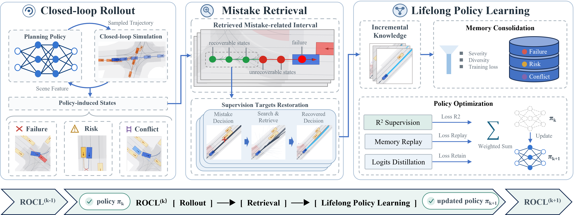
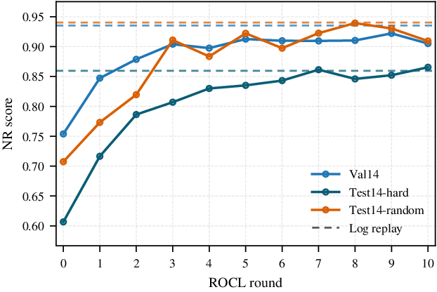

# Learning from Mistakes: Rollout-Retrieval Lifelong Policy Learning for Autonomous Driving

Official implementation of **R2LPL**: **R**ollout-**R**etrieval **L**ifelong **P**olicy **L**earning for autonomous driving.

**Paper:** arXiv link coming soon.

> [!NOTE]
> This repository is still under active cleanup. We are organizing the code, checkpoints, and reproduction instructions, and the full reproduction pipeline has not yet been independently verified.

R2LPL studies how a learned driving policy can improve from its own closed-loop mistakes. Instead of only fine-tuning on expert logs, R2LPL rolls out the current policy, mines recoverable mistake-related states, retrieves feasible corrective targets, and preserves the resulting knowledge through lifelong policy learning.

<p align="center">
  
</p>

## Highlights

- **Mistake-driven policy improvement:** closed-loop rollouts expose failures, risk, and model-expert conflicts that are hard to capture from fixed expert demonstrations alone.
- **Rollout-retrieval corrective supervision:** R2LPL filters recoverable policy-induced states and retrieves feasible target anchors, turning sparse failure evidence into compact supervised knowledge.
- **Lifelong policy learning:** newly retrieved corrections are learned together with replayed memory, improving the policy over multiple rollout-learning rounds while reducing forgetting.

## Main Results

Closed-loop results on nuPlan. NR and R denote non-reactive and reactive simulation protocols.

| Method | Training paradigm | Val14 NR | Val14 R | Test14-hard NR | Test14-hard R | Test14-random NR | Test14-random R |
|---|---|---:|---:|---:|---:|---:|---:|
| Expert | Human log replay | 93.53 | 80.32 | 85.96 | 68.80 | 94.03 | 75.86 |
| UrbanDriver | Imitation learning | 68.57 | 64.11 | 50.40 | 49.95 | 51.83 | 67.15 |
| [PDM-Open](https://github.com/autonomousvision/tuplan_garage) | Imitation learning | 53.53 | 54.24 | 33.51 | 35.83 | 52.81 | 57.23 |
| [PlanTF](https://github.com/jchengai/planTF) | Imitation learning | 84.27 | 76.95 | 69.70 | 61.61 | 85.62 | 79.58 |
| [PLUTO](https://github.com/jchengai/pluto) | Imitation learning | 88.89 | 78.11 | 70.03 | 59.74 | 89.90 | 78.62 |
| [Diffusion Planner](https://github.com/ZhengYinan-AIR/Diffusion-Planner) | Generative IL | 89.87 | 82.80 | 75.99 | 69.22 | 89.19 | 82.93 |
| [Flow Planner](https://github.com/DiffusionAD/Flow-Planner) | Generative IL | 90.43 | 83.31 | 76.47 | 70.42 | 89.88 | 82.93 |
| DFP | Generative IL | 90.33 | 79.97 | 76.91 | 63.56 | 90.69 | 81.96 |
| DFP-FM | Generative IL | **92.68** | 81.30 | 79.43 | 67.94 | 90.62 | 83.59 |
| [Plan-R1](https://github.com/XiaolongTang23/Plan-R1) | IL + RL alignment | 88.98 | **87.69** | 77.45 | 77.20 | 91.23 | **90.04** |
| R2LPL-base | Imitation learning | 75.39 | 73.87 | 60.67 | 65.25 | 70.74 | 72.96 |
| **R2LPL-ROCL-5** | **IL + R2LPL** | 91.26 | 85.38 | **83.51** | **78.38** | **92.25** | 87.99 |
| R2LPL-ROCL-10-best | IL + R2LPL envelope | 92.22 | 85.83 | 86.54 | 78.88 | 93.94 | 88.20 |

R2LPL improves the base planner from **60.67/65.25** to **83.51/78.38** on the challenging Test14-hard split under NR/R protocols, without changing the planner architecture or adding deployment-time rule refinement.

## Iterative Improvement

<p align="center">
  
</p>

Detailed Test14-hard metrics across five ROCL updates:

| ROCL round | Score | Collisions | TTC | Drivable | Comfort | Progress |
|---:|---:|---:|---:|---:|---:|---:|
| 0 Base | 60.67 | 75.55 | 64.76 | 90.81 | 88.24 | 94.81 |
| 1 | 71.64 | 91.36 | 84.92 | 95.95 | 90.81 | 74.68 |
| 2 | 78.63 | 91.54 | 82.72 | 95.59 | 89.34 | 87.78 |
| 3 | 80.70 | 94.85 | 84.56 | 95.22 | 90.44 | 88.87 |
| 4 | 83.00 | 94.49 | 85.66 | 97.43 | 92.28 | 90.16 |
| 5 | 83.52 | 93.20 | 85.29 | 97.43 | 91.54 | 91.80 |

## Setup

The R2LPL are trained and evaluated on nuPlan, please refer to official repo of [nuplan-devkit](https://github.com/motional/nuplan-devkit) for detailed info on installation and dataset setup.

Once you have downloaded the dataset and set up the nuplan-devkit, you can setup R2LPL with:

```bash
git clone https://github.com/Engibacter/R2LPL.git

cd R2LPL

pip install -r requirements.txt

pip install -e .
```

## Reproduction Assets

Download the released checkpoint and planner anchors to the default paths expected by the configs:

From the repository root:

```bash
cd /path/to/R2LPL

wget -O results/checkpoints/muvo_base_model/last.ckpt \
  https://github.com/Engibacter/R2LPL/releases/download/v0.1.0-assets/last.ckpt

wget -O results/planner_anchors/planner_anchors_M4096s_T4.0_step20_full.npy \
  https://github.com/Engibacter/R2LPL/releases/download/v0.1.0-assets/planner_anchors_M4096s_T4.0_step20_full.npy
```

The main rollout continual-learning script uses these locations by default:

```bash
python run/script/run_rollout_cl_auto.py --dry-run --rounds 1
```

## Status

We are preparing the repository for public release. Checkpoints, dataset preparation notes, and full reproduction commands will be updated progressively.

## License

This project is released under the Apache License 2.0.
